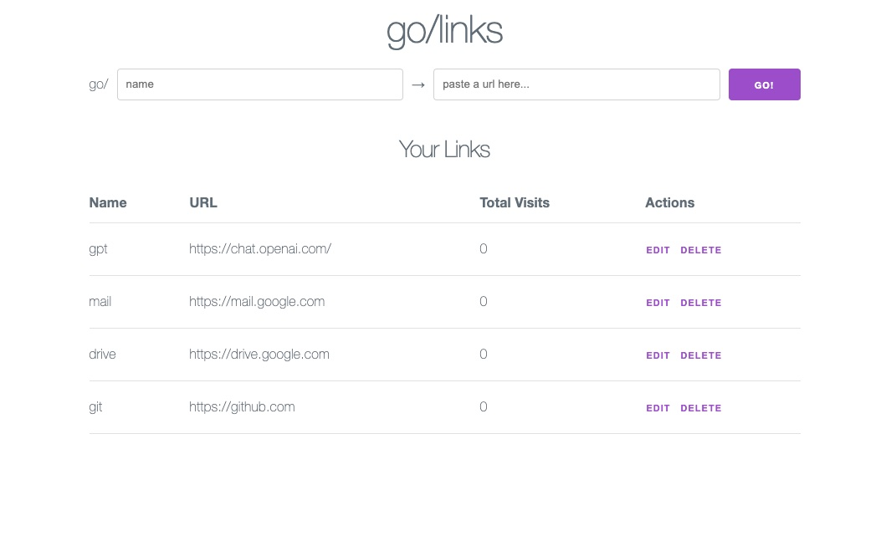

# go/links <!-- omit from toc -->

golinks for your personal setup



- [Features](#features)
- [Installation](#installation)
  - [Requirements](#requirements)
  - [Build from Source](#build-from-source)
  - [Run `golinks`](#run-golinks)
  - [Set up the `go` domain](#set-up-the-go-domain)
  - [Run on Login](#run-on-login)
- [Under the Hood](#under-the-hood)
  - [Client](#client)
  - [Server](#server)

## Features

- Create, edit, delete golinks
- Web client to manage your golinks

## Installation

### Requirements

- Go
- Rust
- [trunk](https://trunkrs.dev/)

### Build from Source

1. Clone this repo
2. Run `make` in the root of the repo to build and install the `golinks` binary

### Run `golinks`

Usage:

```shell
$ golinks -h
Usage of golinks:
  -db string
    	path to database file (default "golinks.sqlite")
  -port int
    	port to run server on (default 7890)
```

To bind the server at `localhost:80` and create the database file in your home directory, run:

```shell
golinks -port 80 -db ~/golinks.sqlite
```

You should see the web client at [localhost/links](http://localhost/links).

### Set up the `go` domain

Add this line to `/etc/hosts`:

```bash
127.0.0.1 go # this can be any name you want
```

You should be able to see the web client at [go/links](http://go/links).

NOTE: You may need to restart the mDNS daemon process (on macOS):

```bash
sudo killall -HUP mDNSResponder
```

### Run on Login

To start `golinks` on login:

On macOS:

1. Open the "Automator" app.

2. Create a new "Application".

3. Select the "Run Shell Script" action.

4. Enter this script:

   ```bash
   ~/go/bin/golinks -port 80 -db ~/golinks.sqlite &>/dev/null &
   ```

   NOTE: `&>/dev/null &` will terminate the Automator application while leaving the `golinks` process running in the background (so you don't get an extra icon in your menu bar).

5. Save the app.

6. Open System Settings, click on "General", and then click on "Login Items". Click the "+" button and choose the Automator app you created.

Alternatively, you can also create a [launchd agent](https://developer.apple.com/library/archive/documentation/MacOSX/Conceptual/BPSystemStartup/Chapters/CreatingLaunchdJobs.html).

## Under the Hood

### Client

The (perhaps very over-engineered) client is a WebAssembly application created using [yew](https://yew.rs/) and Rust. It is styled using [Milligram](https://milligram.io/) with the help of [Stylist](https://github.com/futursolo/stylist-rs) and is built using [trunk](https://trunkrs.dev/).

### Server

The client and API are served by a backend implemented using [Gin](https://gin-gonic.com/) and Go. The database is handled using [GORM](https://gorm.io/) and SQLite.
